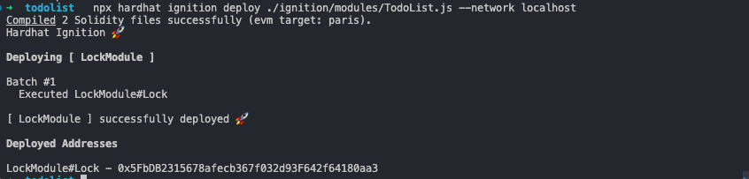
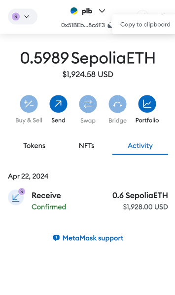
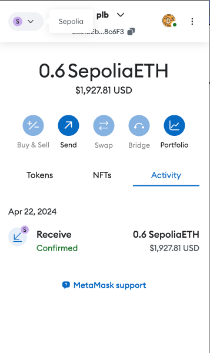
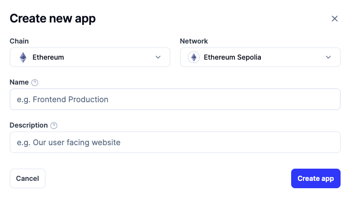
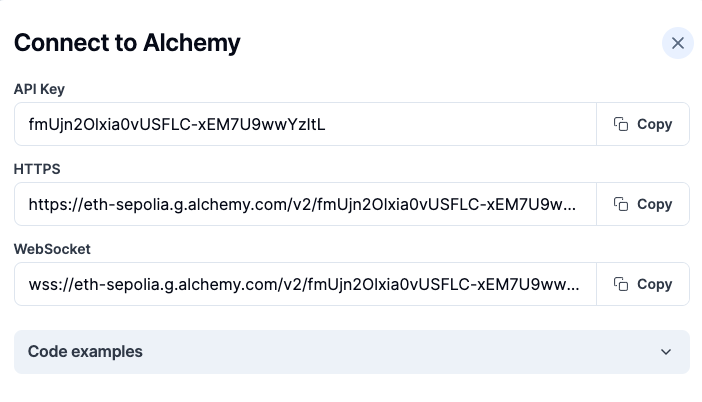
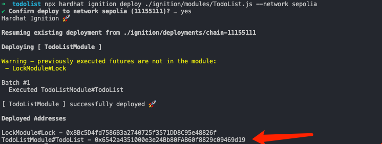

# 练习 - 制作⼀个待办事项列表并将其部署到开发网络

在本练习中，你将开发⼀个任务管理器。 你将使⽤它连接到 Sepolia 测试网络并在其上进行部署。

在本练习的第⼀部分，你的重点是创建项目，添加智能合约，然后将其部署到开发网络。

在本教程中，你将：

- 使用 Visual Studio Code 创建项目。
- 使用 Hardhat 进行编译和部署。
- 使用 Hardhat 本地网络作为区块链开发服务器。

### 创建⼀个新的 hardhat 项目

1. 在终端或命令提示符窗口中，通过输入 `mkdir todolist` 创建⼀个名为“todolist”的新目录。
2. 通过输入 `cd todolist` 转到新创建的目录。
3. 依次输入以下命令：

```
npm init -y //创建空项⽬ 
npm i -D hardhat //安装hardhat依赖 
npx hardhat init // hardhat 初始化JavaScript项⽬
```

1. 在 Visual Studio Code 中，打开 todolist 文件夹。
2. 在 Visual Studio Code 中的 contracts 目录中创建⼀个文件。 将其命名为 TodoList.sol。 在新文件 中，粘贴以下代码。

```
// SPDX-License-Identifier: MIT 
pragma solidity >=0.4.22 <0.9.0; 
contract TodoList { 
uint public taskCount = 0;
 struct Task { 
 uint id; 
 string taskname; 
 bool status; 
 } 
 mapping(uint => Task) public tasks; 
 event TaskCreated( 
 uint id, 
 string taskname, 
 bool status 
 ); 
 event TaskStatus( 
 uint id, 
 bool status 
 ); 
 constructor() { 
 createTask("Todo List Tutorial"); 
 } 
 function createTask(string memory _taskname) public { 
 taskCount ++; 
 tasks[taskCount] = Task(taskCount, _taskname, false); 
 emit TaskCreated(taskCount, _taskname, false); 
 } 
 function toggleStatus(uint _id) public { 
 Task memory _task = tasks[_id];
 _task.status = !_task.status; 
 tasks[_id] = _task; 
  emit TaskStatus(_id, _task.status); 
  } 
  }
```

### 部署到本地网络

1. 在 ignition/modules 文件夹中创建 TodoList.js 文件。 在此文件中，粘贴以下代码以部署 TodoList 智能合约。

```javascript
const { buildModule } = require("@nomicfoundation/hardhat-ignition/modules"); 
module.exports = buildModule("TodoListModule", (m) => { 
const todoList = m.contract("TodoList", []); 
return { todoList }; 
});
```

1. 在主项目目录中，打开 hardhat.config.js。代码应如下所示。

```javascript
require("@nomicfoundation/hardhat-toolbox"); 
/** @type import('hardhat/config').HardhatUserConfig */ 
module.exports = { 
solidity: "0.8.24", 
networks: { 
hardhat: {}, 
}, 
};
```

1. 启动本地网络:`npx hardhat node`
2. 新的命令行界面中部署 TodoList 到本地网络

`npx hardhat ignition deploy ./ignition/modules/TodoList.js --network localhost`



# 练习 - 部署到 Sepolia 测试网络

现在我们有了⼀个智能合约。 我们已将其成功部署到我们的开发网络。 接下来，我们将重点介绍如何 部署到 Sepolia 测试网络。

### 练习概述

在本教程中，我们将通过 MetaMask 使用测试以太币部署到 Sepolia 。 部署过程需要设置⼀个 Infura 帐户或者 Alchemy 账户，用于连接并部署到 Sepolia 测试网。 部署后，可以使⽤用 Sepolia 测试网浏览 器检查已部署到测试网的区块。

### 练习设置

为了设置练习，你将执行以下操作：

1. 安装并设置 MetaMask
2. 获取测试以太币(备份领水https://faucets.chain.link/)。
3. 安装 Alchemy 并将终结点链接到 Sepolia 测试网络。

### 设置 MetaMask

安装并设置 MetaMask（如果尚未这样做）。 然后，在浏览器中登录到你的帐户。

领水到 MetaMask Sepolia 测试网络

使用你的 MetaMask 帐户连接到 Sepolia 测试网络。 首先从 Sepolia 测试 Faucet 获取测试以太币：

1. 打开 MetaMask。
2. 连接到 Sepolia
3. 复制你的帐户的地址。



1. 打开⼀个浏览器窗口或选项卡，转到 Sepolia faucet。
2. 若要申请以太币，请输⼊你的测试网帐户地址，然后选择“Send me test Ether”（向我发送测试 以太币）。


1. 在 MetaMask 中，验证你的帐户现在是否有以太币。



### 使用环境变量保存隐私信息

为了在 hardhat 中使用环境变量我们安装 dotenv

`npm install dotenv --save`

在你的项目根目录下，创建⼀个 .env 文件。这个⽂件将被用来存储敏感信息和配置变量，例如我们 的账户私钥信息 PRIVATE_KEY 以及 ALCHEMY_API_KEY:

```javascript
ALCHEMY_API_KEY=*** 
PRIVATE_KEY=**
```

1. 如何从 metamask 获取我们的账户私钥：PRIVATE_KEY
2. 下⼀步我们将从 Alchemy 获取 ALCHEMY_API_KEY

### 安装 Alchemy 并将终结点链接到 Sepolia 测试网络

Alchemy 开发套件提供对 Ethereum 网络的即时可缩放 API 访问。 Alchemy 是⼀个托管的 Ethereum 节点群集，使用户能够在公用网络上运行应用程序。 使用 Infura 部署到公用网络并与之进行交互。

若要设置帐户，请转到 Alchemy 官网并执行以下步骤：

1. 注册
2. 创建项目



创建好之后可以获取 API_KEY，并且将 API_KEY 粘贴到我们的 `.env` 文件中



### 连接到 Sepolia

在 Visual Studio Code 中返回到 todolist 项目文件夹。

1. 在 Hardhat 配置⽂件 hardhat.config.js 中，加入 Sepolia 的配置

```javascript
require("@nomicfoundation/hardhat-toolbox"); 
require("dotenv").config(); 
/** @type import('hardhat/config').HardhatUserConfig */ 
module.exports = { 
solidity: "0.8.24", 
networks: { 
hardhat: {}, 
sepolia: { 
url:
 "https://eth-sepolia.g.alchemy.com/v2/" + process.env.ALCHEMY_API_KEY, accounts: [`0x${process.env.PRIVATE_KEY}`], 
 }, 
 }, 
 };
```

### 部署到 Sepolia

若要部署到 Sepolia，请从 Visual Studio Code 终端运行以下命令：

`npx hardhat ignition deploy ./ignition/modules/TodoList.js --network sepolia`

如果部署成功，则会看到以下输出：



在 sepolia 的区块链浏览器链接中拼接上面标识的地址可以查看我们部署的该合约：

[https://sepolia.etherscan.io/address/0x6542a4351000e3e24Bb80FAB60f8829c09469d19](https://sepolia.etherscan.io/address/0x6542a4351000e3e24Bb80FAB60f8829c09469d19)


点击标识的 transaction hash 可以查看部署的 tx 的详情

## Infura 教程(可选)

在以太坊上开发的 Dapp 应用（链下）需要与区块链（链上）交互。早期，以太坊上的基础设施很少，开发者需要在本地部署以太坊节点来完成链下和链上的交互，非常麻烦，且耗时数日。

`Infura` 在链下、链上之间搭了一座桥，让两者的交互变的简单。它为用户提供对以太坊和 IPFS 网络的即时、可扩展的 `API` 访问。开发者在 `Infura` 官网注册后，就可以免费申请的以太坊 `API KEY`，就可以利用 `Infura` 的节点与区块链交互。另外，小狐狸 `metamask` 钱包内置了 `Infura` 服务，方便用户访问以太坊网络。

### 创建Infura API Key

1. **打开 Infura 官网并注册**

网址：<u>infura.io</u>


1. **创建 API Key**

注册后，进入控制台 Dashboard，并点击右上角的 **CREATE NEW KEY** 按钮。


2. **填写 API Key 信息(教程学习选择sepolia测试网)**

`NETWORK` 选择 **Web3 API (Formerly Ethereum)**，有的版本这里显示的是 **Ethereum**，`NAME` 随便填一个，我填的 `WTF`，之后点击 **CREATE** 按钮。


3. **API Key 创建完毕**

回到控制台 Dashboard，可以看到名为 `WTF` 的 API Key 已经创建完毕。在控制台 Dashboard，点击 **MANAGE KEY** 按钮，可以查看 API Key 详情。


4. **查看 API Key 详情**

进入 API Key 详情页，我们可以看到我们的 API Key（图中 `184d` 开头的一组密钥）。在下面的 **NETWORK ENDPOINT** 栏中，可以查到以太网主网/测试网的 rpc 节点链接，用于访问链上数据并交互。另外，你可以申请免费的 Layer2 rpc 节点，包括 `Polygon`，`Optimism` 和 `Arbitrum`，但是需要绑定 `visa` 卡。领 `Optimism` 空投那次，公开 rpc 节点卡爆了，而使用 `Infura` 的私人 rpc 节点的人可以正常领取。


## 使用Infura API Key


在你的项目根目录下，创建⼀个 .env 文件。这个⽂件将被用来存储敏感信息和配置变量，例如我们 的账户私钥信息 PRIVATE_KEY 以及 `INFURA_ID`:

```
INFURA_ID=*** 
PRIVATE_KEY=**
```

1. Hardhat 配置⽂件 hardhat.config.js 中，加入 Sepolia 的配置

```
require("@nomicfoundation/hardhat-toolbox"); 
require("dotenv").config(); 
/** @type import('hardhat/config').HardhatUserConfig */ 
module.exports = { 
solidity: "0.8.24", 
networks: { 
hardhat: {}, 
sepolia: { 
url:
 "https://sepolia.infura.io/v3/" + process.env.INFURA_ID, accounts: [`0x${process.env.PRIVATE_KEY}`], 
 }, 
 }, 
 };
```

